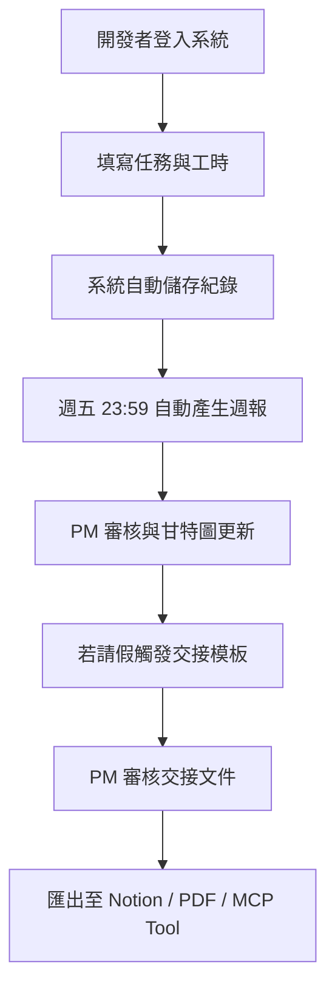
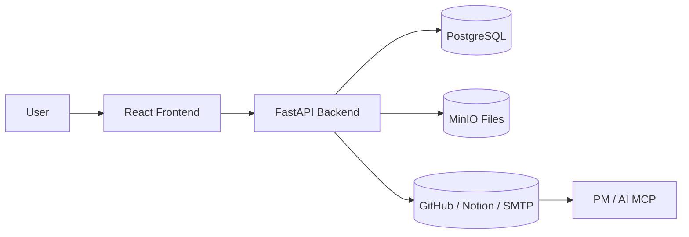
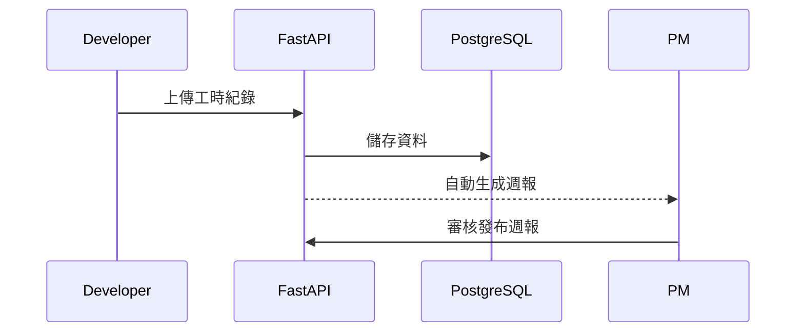
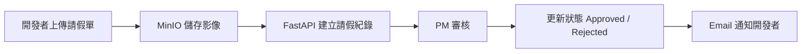
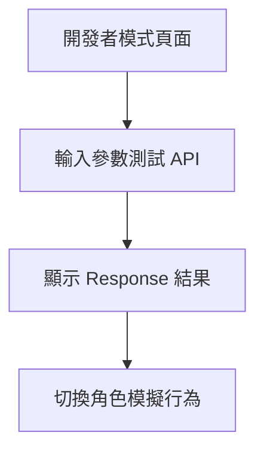
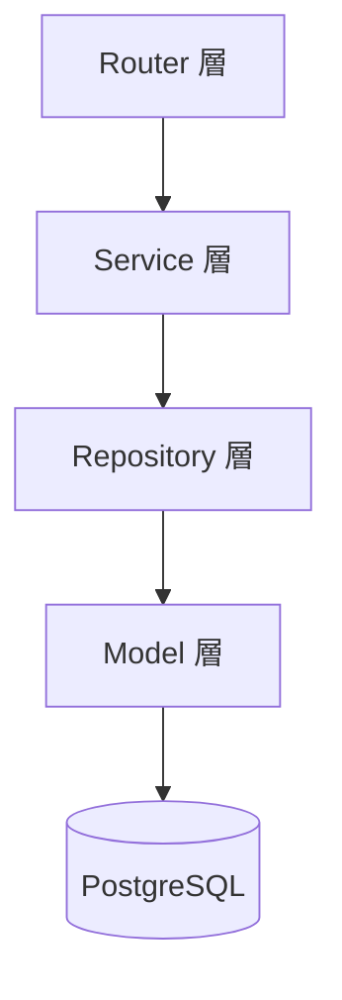
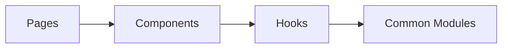
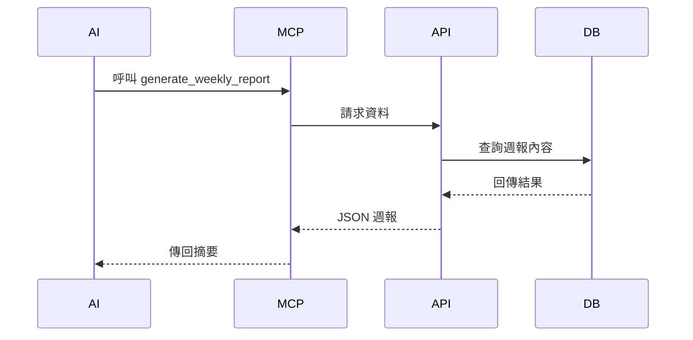
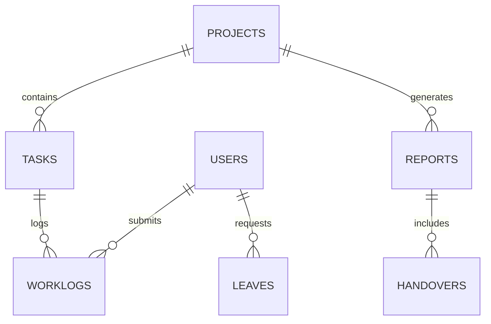

# 📘 專案開發日誌紀錄系統（Project Development Log System, PDLS）

---

## 1️⃣ 專案概述（Project Overview）

**系統用途：**  
PDLS（Project Development Log System）是一套支援團隊化開發的專案管理與紀錄系統，  
主要用於紀錄開發過程、工時、週報、請假與交接文件，並支援外部整合（GitHub、Notion、MCP AI）。

**主要目標：**
- 統一管理專案進度、開發紀錄與工時。  
- 自動化週報與交接流程，提升團隊協作效率。  
- 可整合 AI MCP，讓模型安全存取週報與開發資料。

**使用對象：**
- 小型至中型開發團隊  
- 開發者、專案經理、主管

**開發平台：**
- 前端：React + TypeScript + PrimeReact  
- 後端：FastAPI + PostgreSQL + MinIO  
- 擴充：Tauri / Electron 桌面化部署

---

## 2️⃣ 目標與願景（Goals & Objectives）

| 類別 | 目標 |
|------|------|
| 效率 | 自動生成週報與交接模板 |
| 協作 | 整合 GitHub issue 與工時紀錄 |
| 智能化 | 導入 MCP 工具層，支援 AI 操作 |
| 擴充性 | 可對接 Notion、Slack、SMTP 通知 |

---

## 3️⃣ 使用者與角色定義（Target Users & Roles）

| 角色 | 職責 | 權限 |
|------|------|------|
| Developer | 工時填寫、交接、請假申請 | CRUD（限個人） |
| PM | 審核週報、甘特圖管理、審核請假 | CRUD + 審核 |
| Stakeholder | 閱讀專案週報與成果 | Read-only |
| Admin | 系統維護、角色管理 | Full access |

---

## 4️⃣ 核心功能（Core Features）

- 自動週報產出（Weekly Report）  
- 任務與工時追蹤（Worklog Tracking）  
- 標準化交接模板（Handover Template）  
- 請假與出勤管理（Leave Management）  
- 整合外部工具（GitHub / Notion / SMTP）  
- AI 操作層（MCP Integration Layer）  

---

## 5️⃣ 使用流程（User Flow）

---

## 6️⃣ 系統架構概念（System Overview）

### 🔹 五層結構

1. **前端應用層**（React + TS）  
2. **後端服務層**（FastAPI）  
3. **資料庫層**（PostgreSQL）  
4. **檔案儲存層**（MinIO）  
5. **整合層**（GitHub / Notion / SMTP / MCP）  

---

## 7️⃣ 功能需求細項（Feature Requirements）

### 7.1 週報系統（Weekly Report）
- 每週五晚上自動產生週報  
- 匯出 Markdown / PDF / Notion Page  
- 整合工時、任務與問題列表

### 7.2 工時紀錄（Worklog Tracking）
- 任務級工時輸入與查詢  
- 可關聯 GitHub issue  
- PM 可查看團隊統計圖表  

### 7.3 標準化交接模板（Handover Template）
- 啟用「請假模式」或「專案交接」自動生成模板  
- 包含完成度、注意事項、測試紀錄等欄位  
- 可匯出 Markdown / PDF / Notion Page  

### 7.4 請假與出勤管理（Leave Management）
- 上傳請假單影像（支援 JPG / PNG / PDF）  
- 自動建立請假申請並通知 PM 審核  
- 提供拍照上傳功能  

### 7.5 甘特圖進度管理（Gantt Chart）
- 拖曳調整任務時程與依賴關係  
- 自動同步至週報與工時表  

### 7.6 客戶 PRD 對應（Client PRD Mapping）
- 匯入客戶提供的需求文件（CSV / JSON）  
- 連結至實際任務並自動追蹤進度百分比  

### 7.7 🧪 開發者模式（Developer Mode）
- 測試 API、模擬角色、顯示回應 JSON  
- 可切換 Mock / Real 模式  
- MCP Tool 測試面板（即時執行 Tool 呼叫）  

### 7.8 MCP 整合層（MCP Integration Layer）
- 將系統功能包裝為工具（Tool）供 AI 使用  
- 範例 Tool：  
  - `generate_weekly_report()`  
  - `create_worklog_entry()`  
  - `create_leave_request()`  

---

## 8️⃣ 非功能需求（Non-Functional Requirements）

### 8.1 效能與穩定性
| 項目 | 指標 |
|------|------|
| API 回應時間 | ≤ 300ms |
| 檔案上傳 | ≤ 3 秒 |
| 系統可用率 | ≥ 99.5% |
| 同時使用者 | ≥ 50 |

### 8.2 安全性
- JWT + TLS 傳輸  
- MinIO Presigned URL（有效期 ≤ 1 小時）  
- AI 操作受限於角色權限  

### 8.3 備份與復原
- PostgreSQL 每日備份（保留 7 日）  
- MinIO 鏡像（保留 30 日）  
- 季度復原測試  

### 8.4 模組化架構（Modular Architecture）

### 8.5 前端模組化

### 8.6 CI/CD 與監控
- 使用 GitHub Actions 自動測試與部署  
- Prometheus + Grafana 監控資源使用  
- 結構化 JSON log + Slack 錯誤通知  

---

## 9️⃣ MCP 整合與使用憲章（MCP Integration & Charter）

**AI Tool 清單：**
- `generate_weekly_report`  
- `create_worklog_entry`  
- `create_handover_doc`  
- `create_leave_request`  

**AI 操作憲章：**
- ✅ 可：查詢 / 草擬 / 匯出  
- ❌ 不可：核准 / 刪除 / 修改正式資料  
- 高風險操作需使用者確認  

---

## 🔟 成功指標與驗收條件（Success Metrics & Acceptance Criteria）

| 功能 | 驗收條件 |
|------|-----------|
| 週報 | 自動產生成功率 ≥ 95%，內容正確率 ≥ 90% |
| 工時紀錄 | CRUD 正確性 ≥ 98% |
| 交接模板 | 自動觸發 + 匯出成功 |
| 請假流程 | 通知與狀態更新一致性 ≥ 100% |
| MCP 工具 | Tool 呼叫成功率 ≥ 95% |
| 效能 | 查詢 1000 筆資料 ≤ 1 秒 |

---

## 📎 附錄（Appendix）

### A. ERD 資料表關聯圖

### B. 主要 API 清單
| Method | Endpoint | 功能 |
|---------|-----------|------|
| GET | `/api/v1/reports` | 查詢週報 |
| POST | `/api/v1/worklogs` | 新增工時紀錄 |
| POST | `/api/v1/leaves` | 建立請假申請 |
| GET | `/api/v1/projects` | 查詢專案 |
| GET | `/api/v1/mcp/tools` | MCP 工具清單 |

---

**版本：** 1.0.0  
**最後更新：** 2025-11-12  
**文件用途：** 系統開發、設計審查與驗收依據
